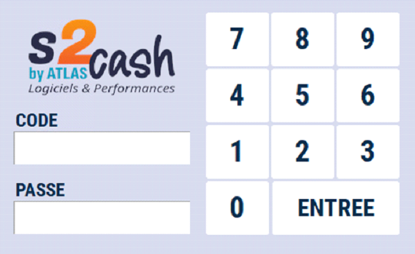
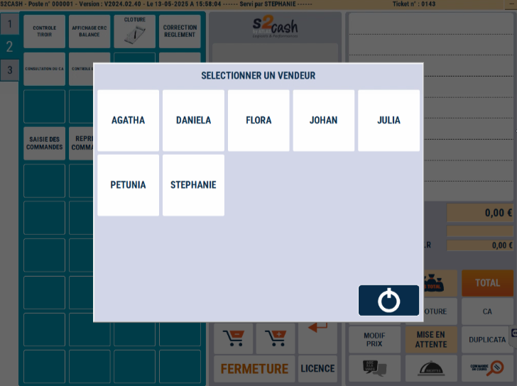

# Sélection d'un vendeur

## Au démarrage

En fonction du paramétrage, S2Cash by Atlas peut soit **démarrer sur un vendeur standard** (généralement appelé CAISSE ou BALANCE) ou vous demander de **sélectionner un vendeur** pour ouvrir le logiciel.

Veuillez-vous **identifier** en saisissant votre code et votre mot de passe ou passez votre Badge devant le lecteur de code à barres.

 
:::warning
S2Cash by ATLAS contrôle que vous n’êtes pas déjà assigné à une autre caisse.
:::

La caisse va s’ouvrir et une **impression d’ouverture de caisse** va s’effectuer.

## Configurations vendeur

Si S2Cash by ATLAS est configuré pour démarrer sur un vendeur standard, plusieurs configurations vendeur sont possibles ([Manuel de gestion - Gestion des utilisateurs](https://aide.seg2inov.fr/docs/category/gestion-des-utilisateurs)). Le système peut alors vous demander de vous identifier :

⦁	soit au début de la vente,

⦁	soit à chaque sélection de produit,

⦁	soit au moment du total du ticket.

## Mode d'identificaction 

Dans ces 3 cas, 2 modes d’identification sont possibles :

|Soit une identification vendeur par nom| Soit une identification vendeur par badge et/ou code |
|:-----------:|:-----------:|
|  |  | 