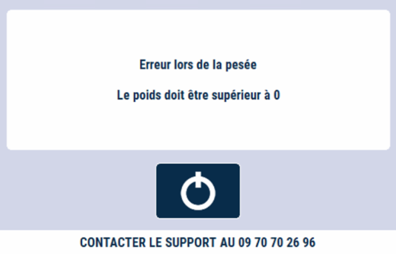
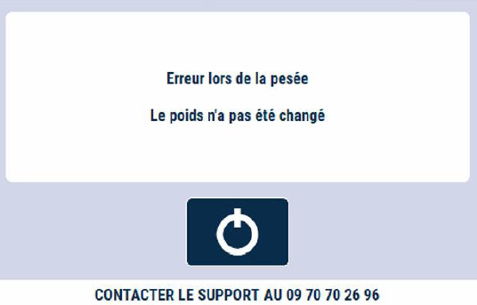

# Les erreurs

S’il s’agit d’un **produit à peser**, le logiciel demande de mettre le **produit sur la balance**.

## Erreur poids égal à 0
Si **aucun** produit n’est posé alors ce message s’affiche : 

    

## Erreur poids non changé

Une fois le produit vendu, vous pouvez l’enlever de la balance.
Si vous sélectionnez un autre produit **sans avoir fait varier le plateau de la balance**, ce message s’affiche :

    

## Erreur stabilité

Tant que la balance n’est pas **stabilisée**, le produit ne peut être vendu.

    

