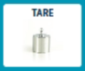
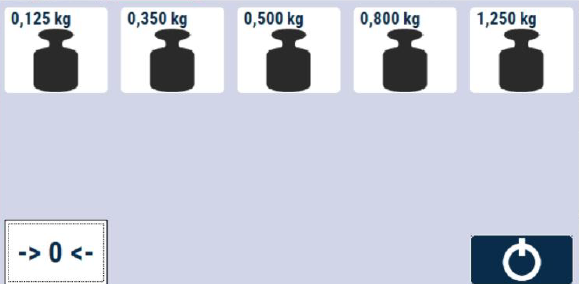
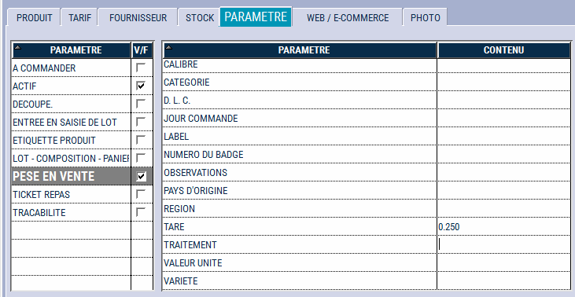
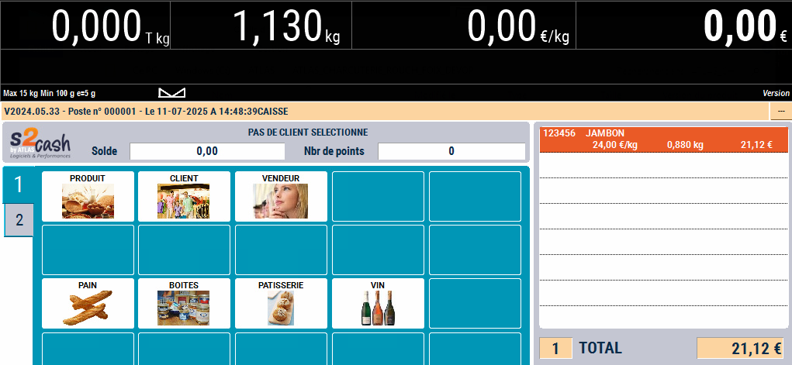

# Tare
## Tare sur ventes en fonction caisse avec balance plateau

Pour affecter une tare à la vente d’un produit, appuyez sur le bouton ```Tare``` :

<div className="contenaireImg">
    
</div>


Vous sélectionnez ensuite la tare qui correspond à votre **emballage** (cagette, barquette, caisse…). 


<div className="contenaireImg">
    
</div>

:::note
Les **différents poids** sont paramétrables mais ne peuvent pas être modifiés en caisse.
:::

Pour supprimer la tare, sélectionnez ```0```.

Le logiciel indique de la présence d'une tare en **couleur**.
Sur le **prochain produit**, S2Cash déduira le poids de cette tare au poids du produit pesé.

<div className="contenaireImg">
    
</div>


:::tip
Exemple :
<li> Vous sélectionnez une tare de 0.350kg </li>
<li> Vous mettez sur la balance une cagette d’oranges de 3.345kg </li>
<li> Vous sélectionnez le produit « orange feuille » </li>
<li> S2Cash by ATLAS enregistre une vente pour un poids de 2.995kg. </li>

Le logiciel a déduit du poids total le poids de la cagette.
:::

## Tare automatique sur produit

Il y a la possibilité de définir une **tare propre au produit** directement dans la fiche du produit concerné.

<div className="contenaireImg">
    
</div>

Lors de l’appel de ce produit en caisse, S2Cash va **automatiquement appliquer une tare** sur le poids de ce produit.

<div className="contenaireImg">
    
</div>

| Partie écran       | Explication | 
|:-----------:|----|
|     |  Poids du produit, Tare déduite. |
|          |  Poids du produit, Tare comprise. |
