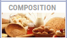

# Actions possibles sur la fiche d’un produit 

| Bouton caisse | Bouton balance | Action | 
|:-----------:|:----:|---------------|
|  |     |  **Ajouter ou enlever une image** pour ce produit. L’image sera affichée en **caisse** et sur les **affiches** ou **étiquettes**. |
|  |   |  Consulter **l’historique des mouvements** effectués sur ce produit. |
|  |  |Consulter le **récapitulatif par mois des mouvements** de ce produit. |
|  |  |  **Ajouter** ce produit dans la **liste des médias**. |
|  |  |  Saisir la **composition du produit**. La composition sera imprimée sur les **étiquettes de traçabilité**. |
|  |   |  Accéder aux **informations saisies sur ce produit** lorsque le vendeur réalise la vente. |
|  |   |  **Créer une recette** pour ce produit. Lorsqu’il sera vendu en caisse ou pesé en balance, le vendeur pourra **imprimer la recette sur l’imprimante ticket**. |
|  |  |  Gérer la **liste des produits qui sont déstockés** dans le cas d’un produit de type **lot** – **panier** – **composition**. Ce bouton **n’apparait que** si la case ```LOT – COMPOSITION``` est cochée. |
|  |  | **Créer directement une promotion à la journée** sur le produit sélectionné. **Afficher la liste des promos** à partir de « ```consultation``` ». **Créer une promotion sur une période** à partir de « ```modification``` ». |