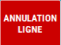

# Annulation produit

## Annuler un produit

Vous pouvez **annuler un produit saisi** que le client ne veut plus ou pour rectifier une erreur. 

| Visuel caisse | Visuel balance |
|:-----------:|:-----------:|
| |    |

Pour cela : 

- 1/  Positionnez-vous sur la ligne du produit à modifier

- 2/  Appuyez sur la touche ```ANNULATION LIGNE```.


    <div className="contenaireImg">
    
    </div>


S2Cash rajoute une ligne **à l’inverse** de la ligne sélectionnée.

<div className="contenaireImg">
    
    </div>

:::note
L’annulation de ligne apparaît sur le **ticket de caisse** et sur la **clôture de fin de journée**.
:::

## Message d'erreur 

Pour **annuler un produit**, il faut sélectionner le produit concerné depuis le panier. Ainsi, si vous appuyez sur la touche ```ANNULATION LIGNE``` alors que le **panier est vide**, ce message d'erreur s'affiche : 

<div className="contenaireImg">
    
    </div>