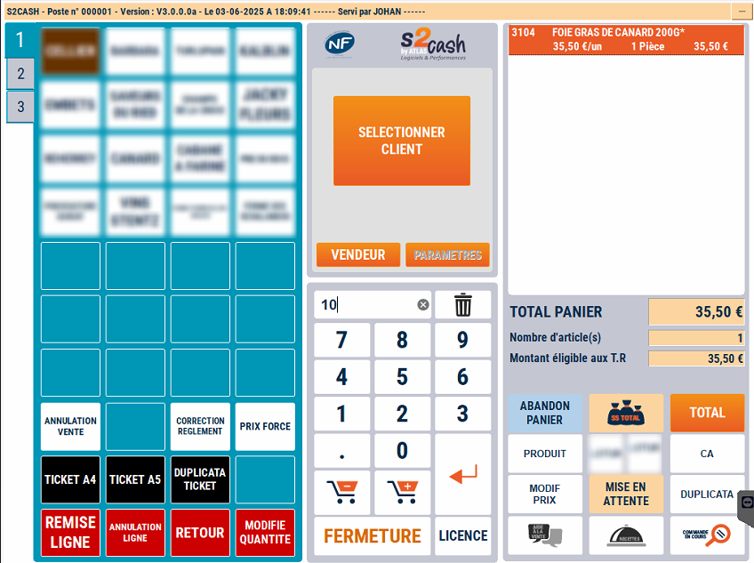

# Changement de quantité

## Changer la quantité

Pour vendre un même produit en plusieurs exemplaires, il faut d’abord **saisir ou scanner le produit** puis **modifier la quantité**.

| Visuel caisse | Visuel balance |
|:-----------:|:-----------:|
| |    |

- 1/  Positionnez-vous sur la ligne du produit à modifier

- 2/  Saisissez la nouvelle quantité

- 3/ Appuyez sur la touche ```MODIFIE QUANTITE``` :

<div className="contenaireImg">
    
    </div>

----------------------------------------------------------------------------

Vous pouvez à tout moment revenir sur le panier en cours pour effectuer une **modification de prix ou de quantité**.

:::warning
Si vous devez à la fois modifier la quantité et forcer le prix sur un même produit, il faut d’abord modifier la quantité puis changer le prix et non l’inverse.
:::

## Message d'erreur 

### Panier vide

Pour **changer la quantité d'un produit**, il faut sélectionner le produit concerné depuis le panier. Ainsi, si vous appuyez sur la touche ```MODIFIE QUANTITE``` alors que le **panier est vide**, ce message d'erreur s'affiche : 

<div className="contenaireImg">
    
    </div>

### Balance avec bandeau de poids Precia Molen 

Sur une balance avec bandeau de poids de la marque Precia Molen, si vous **modifiez manuellement la quantité**, ce message d'erreur s'affiche : 

<div className="contenaireImg">
    
</div>

En effet, la règlementation NMI, à laquelle les balances Précia Molen sont conformes, rend illégale cette manipulation.