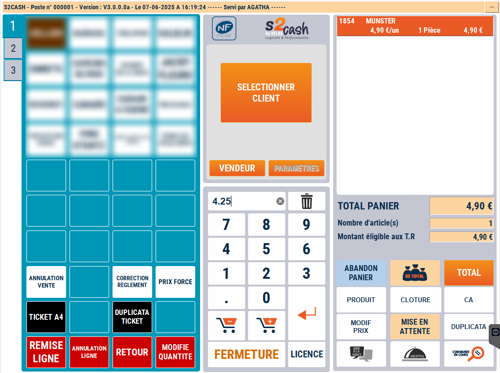

# Prix forcé

Pour modifier le prix d’un produit, il faut d’abord **saisir ou scanner le produit** puis **modifier le prix**.


    <div className="contenaireImg">
    
    </div>


- 1/  Positionnez-vous sur la ligne du produit à modifier

- 2/  Saisissez le nouveau prix

- 3/ Appuyez sur la touche ```MODIF PRIX```


    <div className="contenaireImg">
    
    </div>

Vous pouvez à tout moment revenir sur le panier en cours pour effectuer une **modification de prix ou de quantité**.

:::warning
Si une remise a été saisie au préalable, S2Cash va le supprimer automatiquement. Si vous devez à la fois modifier la quantité et le prix sur un même produit, il faut d’abord modifier la quantité puis changer le prix, et non l’inverse.
:::