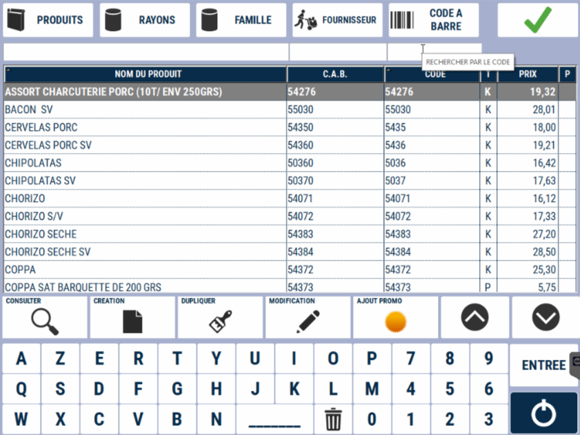

# Rechercher et intégrer un produit à la vente en cours

## 1ère méthode : Accès à partir de la liste des catégories visibles

### Sélection d'une catégorie


    <div className="contenaireImg">
    
    </div>


Sur la partie **gauche** de votre caisse, une zone bleue affiche plusieurs écrans contenant différentes catégories de produits. Vous pouvez naviguer entre ces écrans à l'aide des onglets situés à gauche, nommés ici 1, 2 et 3. 

Sélectionnez la **catégorie** qui vous intéresse.

### Sélection du produit


        <div className="contenaireImg">
    
    </div>


Une fois la catégorie sélectionnée, choisissez le **produit** qui vous intéresse.

### Panier 

Le produit sélectionné apparaît maintenant dans **votre Panier**, **en haut à droite de l’écran**.

        <div className="contenaireImg">
    
    </div>


## 2ème méthode : Accès à partir du bouton Produit

### Onglet recherche

Pour accéder à la liste des produits, cliquez sur le bouton ```PRODUIT```, situé **en bas à droite de l’écran**.
    <div className="contenaireImg">
    
    </div>

Vous arrivez alors sur la page de recherche des produits :
    <div className="contenaireImg">
    
    </div>


### Recherche triée  
Vous pouvez affiner votre recherche en sélectionnant un critère de tri :
<li>Rayon</li><li>Famille</li><li>Le fournisseur</li><li>Le code bar</li>
Ces  boutons se trouvent **en haut à gauche de l’écran**. Une fois votre choix fait, validez avec le **bouton Vert** en haut. 

:::note
Exemple avec la recherche par Rayon et par Famille
:::

|<div className="contenaireImg">  </div>| <div className="contenaireImg">  </div>|
|:-----------:|:-----------:|
| Vous accédez à la liste des produits du rayon sélectionné. | Vous obtenez la liste des produits triés par famille. |
| |    |

### Recherche globale

La touche **"produits"** en haut à gauche de l'écran affiche la liste complète des produits, triés par **ordre alphabétique**.

<div className="contenaireImg">
    
</div>

Grâce au clavier numérique, vous pouvez filtrer et accélérer votre recherche :

<div className="contenaireImg">
    
</div>

## Affichage du prix

Le prix net à payer s’affiche directement sous la liste des produits sélectionnés.

<div className="contenaireImg">
    
</div>