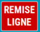
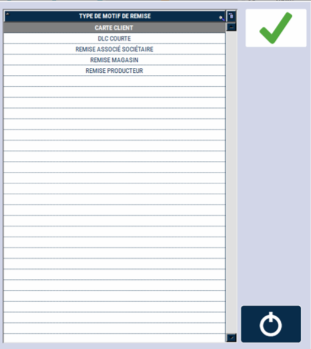

# Remise sur produit


Vous pouvez pratiquer une remise en pourcentage sur un produit de la vente en cours.


    <div className="contenaireImg">
    
    </div>


- 1/  Positionnez-vous sur la ligne du produit à modifier

- 2/  Saisissez le pourcentage de remise

- 3/ Appuyez sur la touche ```REMISE LIGNE```.


    <div className="contenaireImg">
    
    </div>

Le système vous demandera alors de saisir le **motif de la remise**.
Une nouvelle ligne apparaît indiquant le pourcentage et le montant de la remise.


Si votre remise est incorrecte, vous pouvez recommencer la fonction ou saisir « 0 » pour l’annuler.
Les remises sont comptabilisées et apparaissent sur la clôture de caisse.

**Différents types de remise sont possibles.**

    <div className="contenaireImg">
    
    </div>


:::danger
Le système S2Cash by Atlas peut être configuré avec une **remise ligne fixe**, dans ce cas quel que soit le montant saisi de la remise, le système applique toujours le montant paramétré.
:::