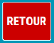
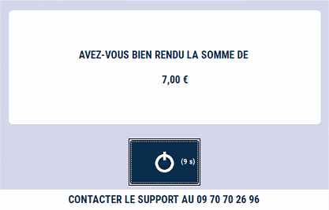

# Retour produit

Lorsque le client souhaite retourner un produit :  


- 1/  **Ressaisissez la ligne de vente** telle qu’elle apparaît sur le ticket d’origine :

<li>Même prix</li>
<li>Même quantité</li>

<div className="contenaireImg">
    
    </div>

- 2/  Appuyez sur la touche ```RETOUR```

<div className="contenaireImg">
    
    </div>

-----------------------

Vous devez alors sélectionner un **motif de retour**. 

:::tip
La **liste des motifs de retour** est modifiable depuis la gestion. Pour plus d’informations, cliquez sur le lien suivant : [Manuel de gestion - Mise à jour des motifs de retour](https://aide.seg2inov.fr/docs/manuel-gestion/gestion-de-caisse/maj-motifs-retour). 
:::

-----------------------

La ligne passe alors en **négatif**.

<div className="contenaireImg">
    
    </div>

:::note
Vous pouvez vendre d’autres produits. 
:::

----------------

Si le total de la vente est **négatif**, S2Cash vous demande si vous avez bien remboursé le client. 

<div className="contenaireImg">
    
    </div>

:::note
Les retours sont comptabilisés dans la **clôture de caisse**.
:::