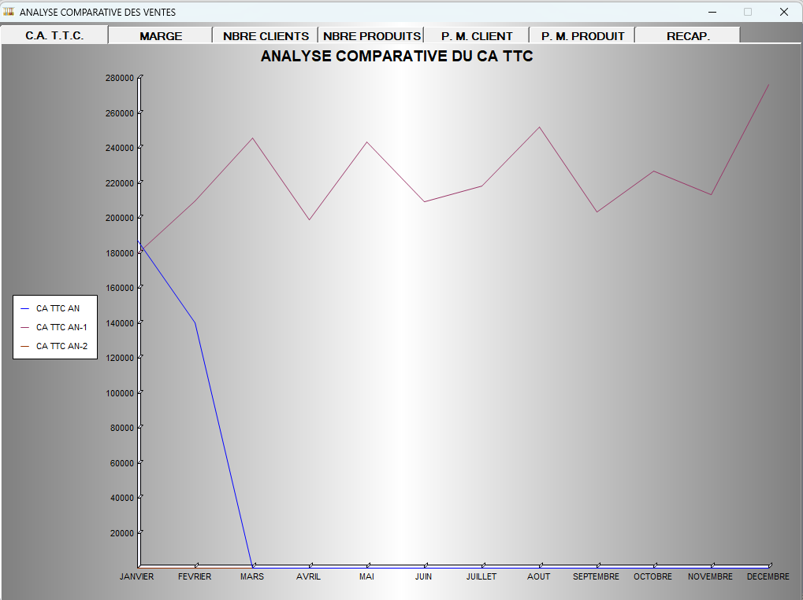
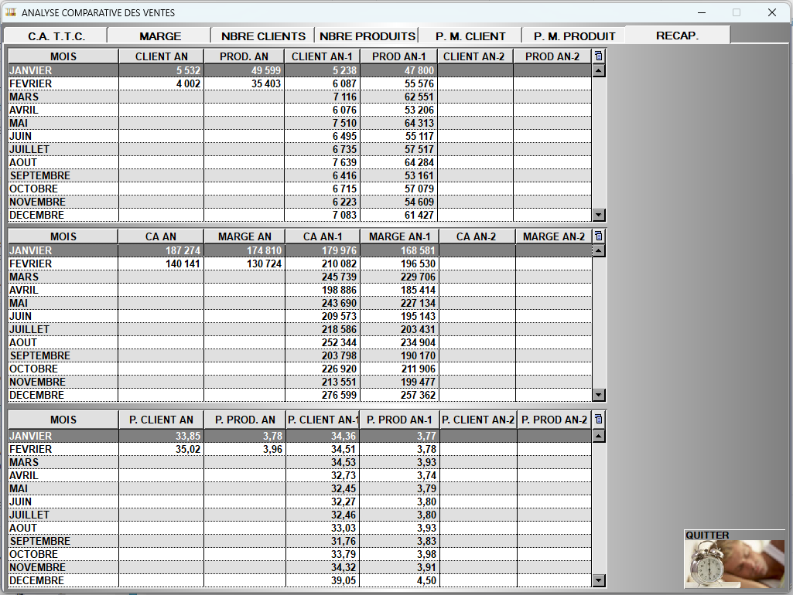

# Analyse comparative

S2Cash vous offre la possibilité de **suivre les courbes d’évolution** :
<li> de votre chiffre d’affaires,</li>
<li> de la marge,</li>
<li> du nombre de clients </li>
<li> du nombre de produits vendus, </li>
<li> du panier moyen client et produit. </li>

Ces courbes sont mises en parallèle avec celles des **2 années précédentes**.

    
    

Vous avez également un onglet affichant un tableau récapitulatif de ces données. 

    
    
