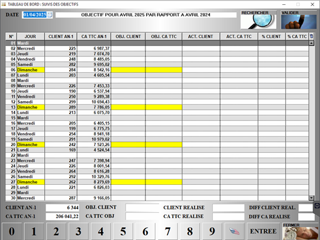

# Suivi des objectifs 

Cette fonctionnalité permet de **mettre en place des objectifs**, tant en nombre de clients, qu’en chiffre d’affaires. 

Sélectionnez une **date en haut à gauche**. S’affichent alors les données du mois sélectionné, ainsi que les données du même mois de l’année précédente. 

    
    

:::tip
Par exemple, si vous sélectionnez le 3 avril 2025, vous aurez les données des mois d’avril 2025 et d’avril 2024. 
:::

Les données suivantes s’affichent alors : 

|Colonne |Information |
|:---------------:|---------|
| | Le nombre de client lors du mois sélectionné de l’année précédente. |
| | Le chiffre d’affaires lors du mois sélectionné de l’année précédente. |
| | L’objectif du nombre de clients à atteindre. |
| | L’objectif du chiffre d’affaires à atteindre. |
| | Le nombre de clients lors du mois sélectionné de l’année en cours. |
| | Le chiffre d’affaires lors du mois sélectionné de l’année en cours. |
| | Le % d’atteinte de l’objectif client. |
| | Le % d’atteinte de l’objectif de chiffre d’affaires.|