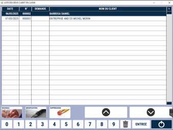
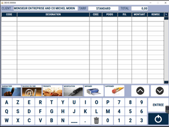

# Devis clients

Vous avez la possibilité de **créer des devis pour vos clients**. S2Cash affiche la liste des devis clients déjà réalisés :

<div className="contenaireImg">
    
    </div>

Vous pouvez : 

 Créer un nouveau devis. 

 Modifier un devis existant. 

 Supprimer un devis. 

## Créer un nouveau devis 

Après avoir appuyer sur la touche ```NOUVEAU```, vous allez devoir **sélectionner un client** pour lequel le devis va être réalisé. La fenêtre suivante apparait. 

<div className="contenaireImg">
    
    </div>

Ainsi, vous allez pouvoir : 

|Bouton |Action |
|:--:|------|
|  | **Ajouter des produits**. |
|  | **Ouvrir la fiche du produit** sélectionné en mode modification. |
|  | **Supprimer** un produit. |
|  | Transformer le **devis en commande**. |
|  | **Enregistrer** le devis pour le reprendre plus tard. |
|  | **Imprimer** le devis. |
