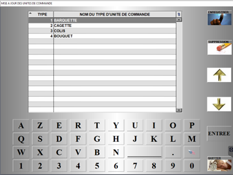
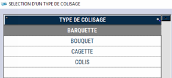
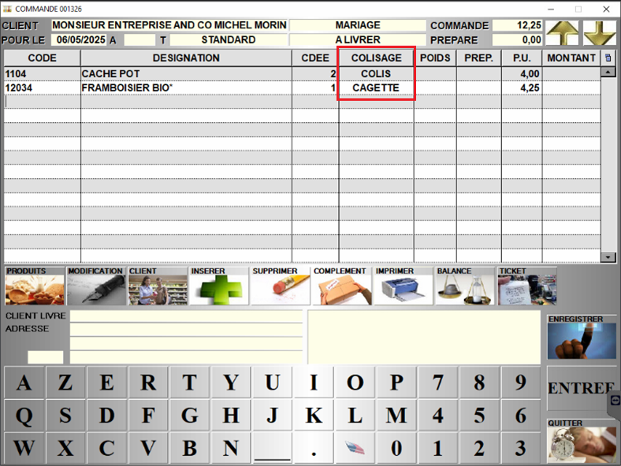

# Mise à jour des unités de commandes

Cette fenêtre vous permet de **renseigner des unités de commande**, que vous pourre choisir lors de la saisie d'une commande. 

<div className="contenaireImg">
    
    </div>

:::note
Pensez à enregistrer votre saisie.
:::

Ainsi, lors de la saisie d’une commande, vous pourrez retrouver cette liste dans la colonne ```COLISAGE```. 

<div className="contenaireImg">
    
    </div>

<div className="contenaireImg">
    
    </div>

:::warning
Cette saisie est une **aide à la préparation de commande**, uniquement à titre **indicatif**. Cela n’a pas d’incidence sur les stocks. 
:::