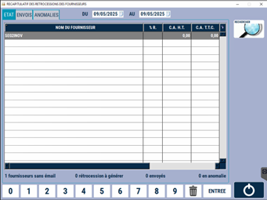
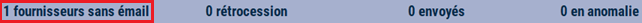

# Les états de rétrocession 

Vous pouvez établir les états de rétrocession pour vos fournisseurs. 

La page d’accueil affiche la liste des **fournisseurs identifiés en tant que producteurs**. 

:::tip
Pour qu’un fournisseur soit identifié comme producteur, il faut que le **code comptable du fournisseur soit renseigné** sur sa fiche, et que les **3 premiers caractères soient 999**. 
:::

<div className="contenaireImg">
    
    </div>

Depuis cette page, vous pouvez **envoyer par mail à chaque fournisseur** leurs états de rétrocession. 

|Sélectionnez la date ou la période| puis appuyer sur ```RECHERCHER``` |
|:--------:|:----------:|
|  |  |

Pour cela, il faut que **l’adresse mail du fournisseur soit renseignée dans sa fiche fournisseur** (cf. MAJ FOURNISSEURS). Dans le cas contraire, S2Cash by Atlas vous informe du nombre de fournisseurs de la liste dont le mail n’est pas renseigné. 

<div className="contenaireImg">
    
    </div>

Vous pouvez également voir le **nombre de rétrocession à générer**, le nombre d’états de rétrocession **envoyés** ou **en anomalie**. 

|ECRAN | EXPLICATION |
|:--------:|----------|
|  | Afficher la liste des états envoyés. |
|  | Afficher la liste des états qui n'ont pas réussi à s'envoyer. |
|  | Renvoyer tous les états en anomalie. |