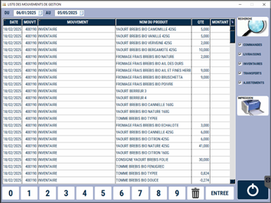

# Liste des mouvements

Vous avez la possibilité de **suivre la totalité des mouvements effectués sur votre point de vente**.

Sélectionnez une **période** : 

<div className="contenaireImg">
    
    </div>

Le ou les **types de mouvements** que vous souhaitez afficher : 

<div className="contenaireImg">
    
    </div>

Puis appuyez sur ```RECHERCHE``` : 

<div className="contenaireImg">
    
    </div>

La liste des mouvements apparait alors dans le tableau :

<div className="contenaireImg">
    
    </div>

Vous avez la possibilité d'exporter le tableau en format PDF ou de l'imprimer : 

<div className="contenaireImg">
    
    </div>