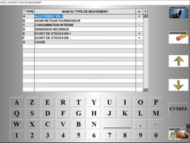

# Mise à jour des mouvements

Cette fenêtre vous permet de **gérer les types de mouvements**.

<div className="contenaireImg">
    
    </div>

Saisissez un type en suivant ceux déjà en place, **attribuez un nom** à ce mouvement et **renseignez l’impact qu’il a sur le stock** :

<li> ```Positif``` : ce mouvement viendra **ajouter des produit au stock**. </li>

<li> ```Négatif``` : ce mouvement viendra **enlever des produits du stock**. </li>

Vous pouvez **enregistrer les modifications**, ou **supprimer** un enregistrement. 
