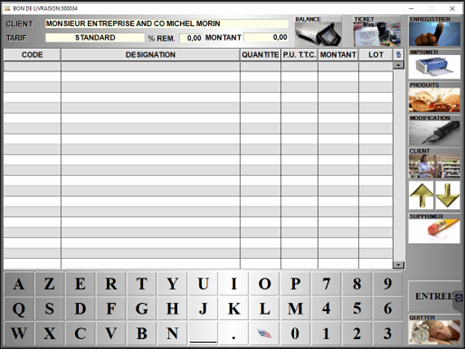

# Ventes en compte 

Cet onglet concerne les **ventes entre professionnels**, c’est-à-dire dans le cas où votre client est une entreprise.  

Vous avez 2 possibilités pour créer une vente en compte pour une client. 

## N°1 : Créer une vente en compte depuis l'onglet ```VENTES EN COMPTE```

    Cliquer sur ```NOUVEAU```. 

Cette fenêtre s’affiche :

<div className="contenaireImg">
    
    </div>

Vous pouvez alors : 

|Bouton |Action |
|:--:|------|
|  | **Ajouter des produits** à la vente en compte. Vous pouvez également ajouter un produit en saisissant directement son code dans la colonne CODE.|
|  | **Ouvrir la fiche du produit** sélectionné en mode modification. |
|  | Accéder à la **fiche du client**. |
|  | Lire le **ticket d'une caisse**. |
|  | Lire le **ticket d'une balance**. |
|  | **Supprimer un produit** de la vente en compte. |
|  | **Enregistrer** la vente en compte. Vous pouvez revenir dessus à tout moment.|
|  | **Imprimer** la vente en compte. |

Une fois la vente en compte saisie, vous pouvez ```ENREGISTRER```. 

S2Cash vous alors demande si la commande a été **complètement préparée**. 

<div className="contenaireImg">
    
    </div>

### Commande non préparée

Si vous cliquez sur ```NON```, la vente en compte sera enregistrée et apparaitra sur la **page d’accueil des ventes en compte**, avec la liste des ventes en compte ```A PREPARER```. 

Vous pouvez alors **modifier** ou **supprimer** une vente en compte **non complétée**. 

### Commande préparée

Si vous cliquez sur ```OUI```, la vente en compte préparée sera alors dans les ventes ```A FACTURER```, et un **bon de livraison** sera édité. 

## N°2 Créer une vente en compte depuis la caisse

Saisissez **en caisse les produits choisis**, et associez la vente à un **client professionnel**. 

<div className="contenaireImg">
    
    </div>

:::note
Lorsque le client est renseigné comme étant un **professionnel** dans sa fiche client, la vente sera **automatiquement** une vente en compte. 
:::

Lorsque vous appuyez sur ```TOTAL```, S2Cash ne vous permet pas de procéder au règlement. Un **bon de livraison** est imprimé, et **le panier est alors transféré dans les ventes en compte**, dans l’onglet ```A FACTURER```. 


## Accéder aux ventes en compte préparées

Pour accéder aux ventes en compte préparées, appuyez sur la touche ```A FACTURER```.  

<div className="contenaireImg">
    
    </div>

Vous trouverez alors la liste des **ventes en compte préparées** et pour lesquelles un **bon de livraison a été édité**, que ce soit depuis la caisse (ticket) ou directement depuis l’onglet ventes en compte.

<div className="contenaireImg">
    
    </div>

Sélectionnez la **période** ainsi que les **lignes** souhaitées. 

Vous pouvez alors : 

|Editer des bons de livraison | Editer des factures |
|:------:|:-------:|
| |  |
| |  |

:::warning
Lorsque vous éditez une facture pour une vente en compte, cette dernière n’apparaitra plus dans la liste des ventes à facturer. 
:::