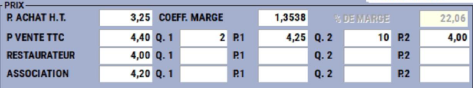
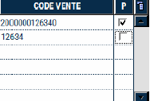
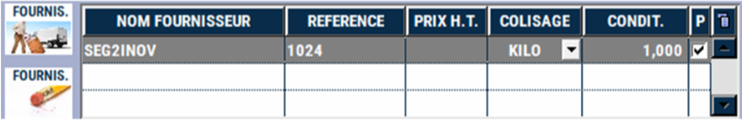
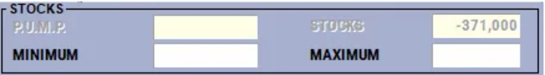

# Sélectionner un produit pour réaliser des actions

## Les prix

    

Le prix d’**achat HT**, le **coefficient** de marge ainsi que le **pourcentage de marge**.

Le(s) prix(s) de **vente** du produit et les **prix dégressifs** par quantité (ici pour 2 Kg et 10 Kg).

:::tip
Dans l’exemple donné, ce produit est vendu
<li>Pour un **PARTICULIER** : 4,40 €/Kg, 4,25€/Kg pour 2 Kg, 4€/Kg pour 10 Kg.</li>
<li>Pour une **COLLECTIVITE** ou un **RESTAURANT** : 4€/Kg</li>
<li>Pour une **ASSOCIATION** : 4,20€/Kg </li>
:::

## Code vente

    

Les différents codes de vente et codes à barre du produit.
Le code coché P (Principal) est envoyé aux balances et imprimé sur les étiquettes.

## Fournisseur
    

| Partie écran       | Explication | 
|:-----------:|----|
|     |  Ajouter ou retirer un fournisseur. |
|  |  Cocher pour indiquer le fournisseur principal. |

## Stocks

    

Le **PUMP** et le **stock actuel du produit**.

Le **stock Minimum** et le **stock Maximum** sert aux commandes **fournisseur** par alerte.

:::tip
A titre informatif, le PUMP est le **Prix Unitaire Moyen Pondéré**, aussi appelé parfois CUMP pour Coût Unitaire Moyen Pondéré. Cette valeur correspond à la moyenne des prix d’achats d’un produit, pour peu que les réceptions soient toutes saisies et validées.

**Méthode de calcul du PUMP :** (valeur stock initial + valeur entrée) / (quantité stock initial + quantité entrée).
Par exemple, une entreprise achète 1 000 unités d’un article à 10€HT pièce, elle achète ensuite 500 unités du même article pour 13€HT pièce.
:::