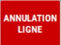

# Annulation poduit

Pour annuler un produit saisi que le client ne veut plus ou pour rectifier une erreur :


    <div className="contenaireImg">
    
    </div>


- 1/  Positionnez-vous sur la ligne du produit à modifier

- 2/  Appuyez sur la touche ```SUPPRIME LIGNE```.


    <div className="contenaireImg">
    
    </div>

S2Cash by Atlas rajoute une ligne au ticket à l’inverse de la ligne sélectionnée.


    <div className="contenaireImg">
    
    </div>


S2Cash by Atlas rajoute une ligne au ticket à l’inverse de la ligne sélectionnée.

L’annulation de ligne apparaît sur le ticket de caisse et sur la clôture de fin de journée.