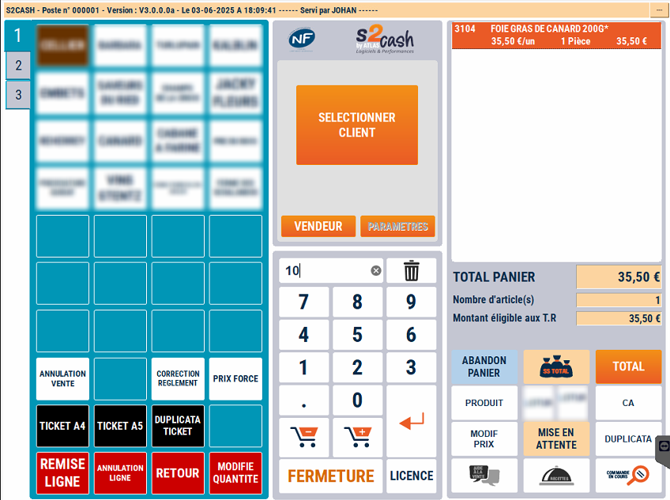
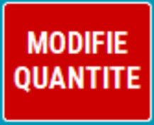

# Changement de quanité


Pour vendre un même produit en plusieurs exemplaires, il faut d’abord saisir ou scanner le produit puis modifier la quantité.


    <div className="contenaireImg">
    
    </div>


- 1/  Positionnez-vous sur la ligne du produit à modifier

- 2/  Saisissez la nouvelle quantité

- 3/ Appuyez sur la touche ```MODIFIE QUANTITE```.


    <div className="contenaireImg">
    
    </div>

Vous pouvez à tout moment revenir sur le ticket en cours pour effectuer une modification de prix ou de quantité.

:::danger
Si vous devez à la fois modifier la quantité et forcer le prix sur un même produit, il faut d’abord modifier la quantité puis changer le prix et non l’inverse.
:::