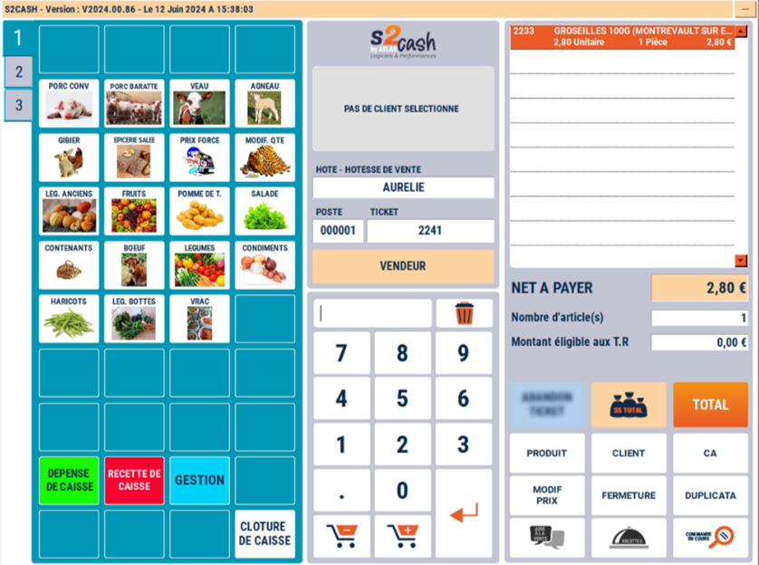
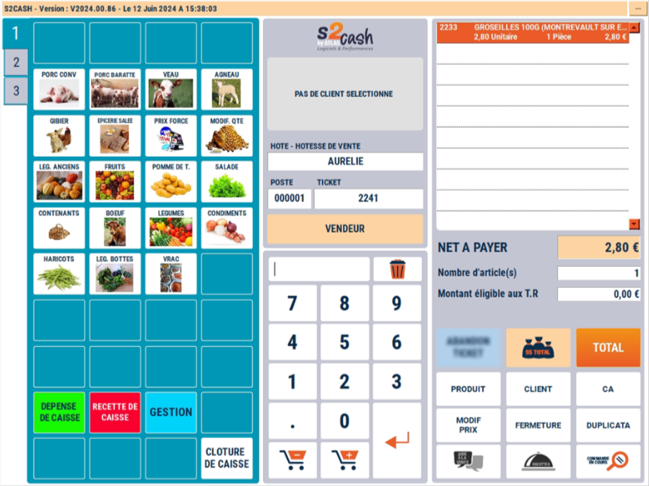
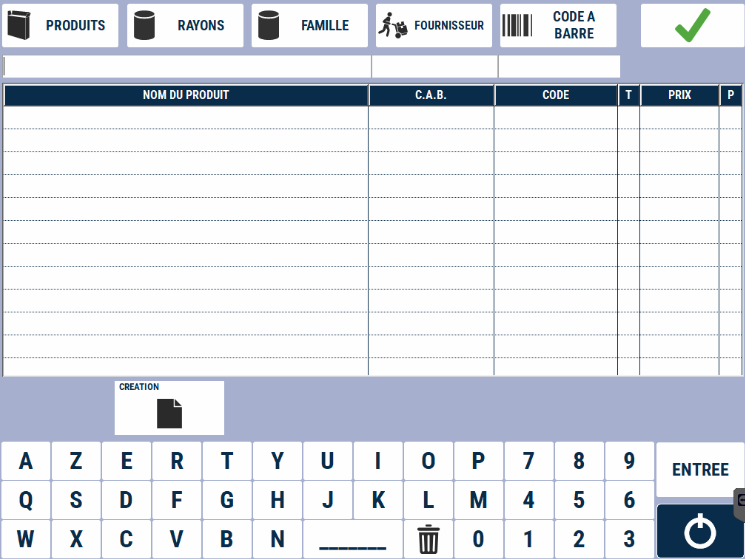
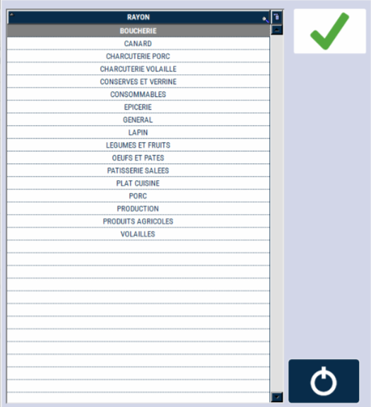
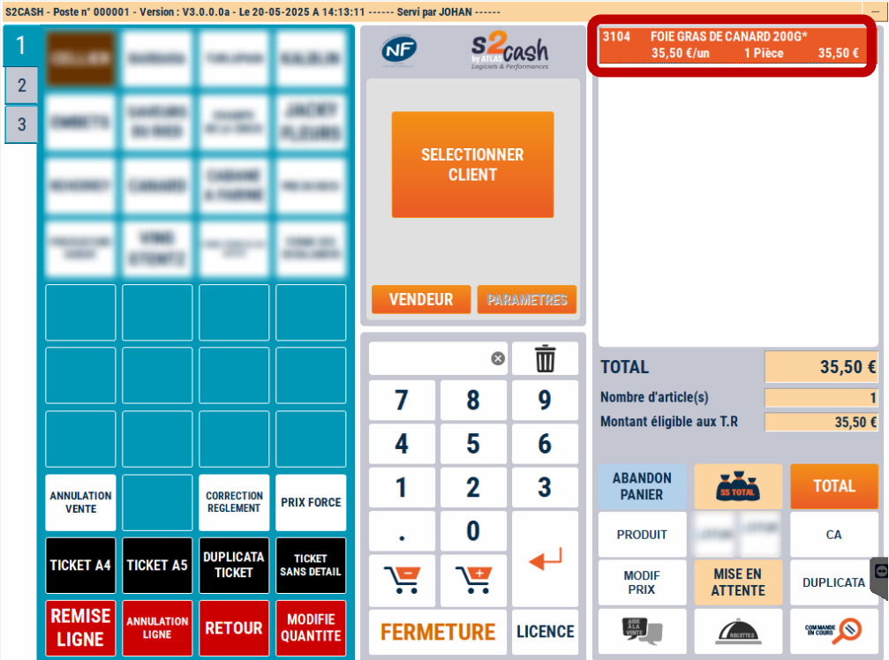
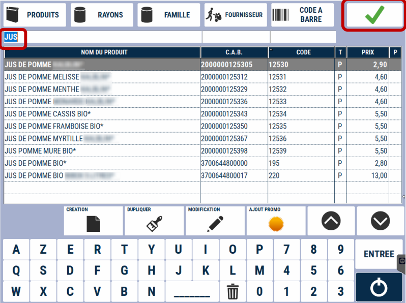
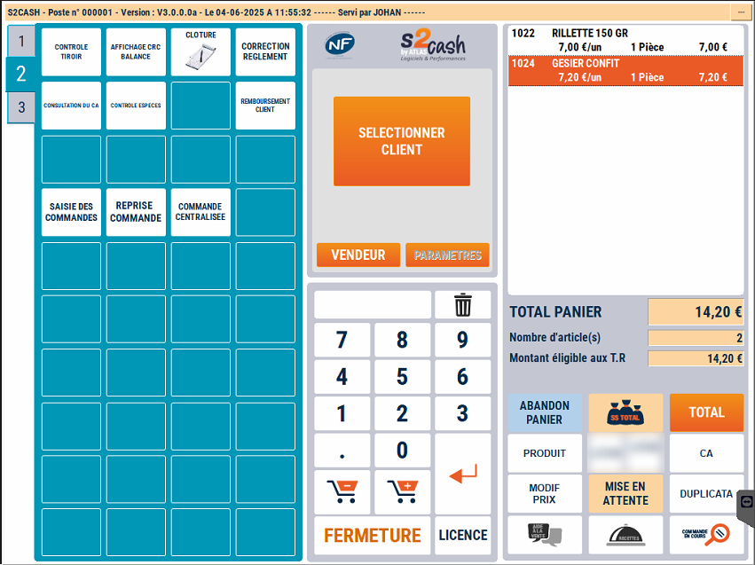

# Rechercher et intégrer un produit à la vente en cours

## 1ère méthode : Accès à partir de la liste des catégories visibles

### Sélection d'une catégorie

    

    
    

Sur la partie **gauche** de votre caisse, une zone bleue affiche plusieurs écrans contenant différentes catégories de produits. Vous pouvez naviguer entre ces écrans à l'aide des onglets situés à gauche, nommés ici 1, 2 et 3. Sélectionnez la **catégorie** qui vous intéresse.

### Sélection du produit

        

    
    

Une fois la **catégorie sélectionnée**, choisissez le produit qui vous intéresse.

### Panier 

        

    
    

Le produit sélectionné apparaît maintenant dans **votre Panier**, en haut à **droite de l’écran**.

## 2eme : Accès à partir du bouton Produit (5 possibilités pour rechercher un produit)

### Onglet recherche

Pour accéder à la liste des produits, cliquez sur le bouton Produit, situé en bas à droite de l’écran.
    

    
    

Vous arrivez alors sur la page de recherche des produits :
    

    
    

### Recherche Triée  
Vous pouvez affiner votre recherche en sélectionnant un critère de tri :
<li>Rayon</li><li>Famille</li><li>Le fournisseur</li><li>Le code bar</li>
Ces  boutons se trouvent **en haut à gauche de l’écran**. Une fois votre choix fait, validez avec le **bouton Vert** en haut. 

:::note
Exemple avec la recherche par Rayon et par Famille
:::

|
  
| 
  
|
|-----------|-----------|
| Vous accédez à la liste des produits du rayon sélectionné.|   Vous obtenez la liste des produits triés par famille. |

    

### Recherche globale 

L’option **"Tous les produits"** en haut à gauche de l'écran affiche la liste complète des produits, triés par ordre alphabétique.

    

Grâce au clavier numérique, vous pouvez filtrer et accélérer votre recherche :

    

## Affichage du prix

Le prix net à payer s’affiche directement sous la liste des produits sélectionnés.

    

