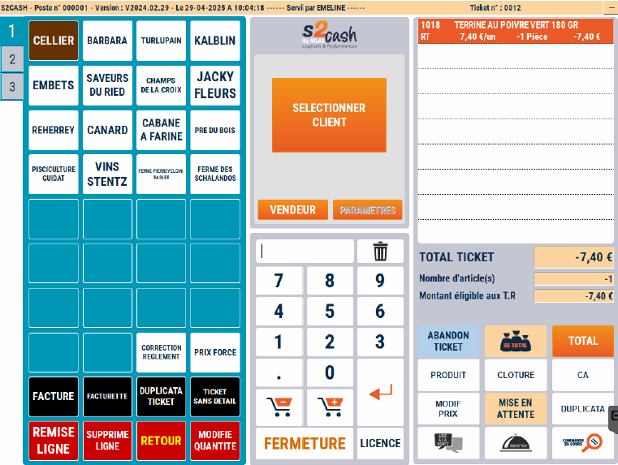
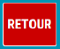
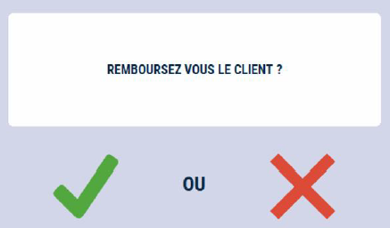
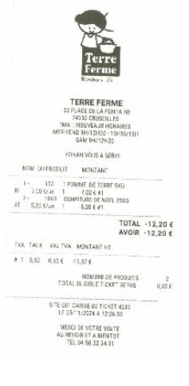

# Retour produit

Le client ramène un produit :


    <div className="contenaireImg">
    
    </div>


- 1/  Ressaisissez la ligne de vente telle qu’elle apparaît sur le ticket d’origine :

<li>Même prix</li>
<li>Même quantité</li>

- 2/  Appuyez sur la touche ```RETOUR```


    <div className="contenaireImg">
    
    </div>

La ligne passe en **négatif**.


Vous pouvez vendre d’autres produits

Si le total de la vente est négatif, S2Cash by Atlas vous demande si vous remboursez le client en espèces.


Si la caisse n’accepte pas les avoirs, ce message n’apparaît pas.


    <div className="contenaireImg">
    
    </div>


Dans le cas d’une réponse négative un avoir est généré permettant une utilisation future.


Les retours sont comptabilisés dans la clôture de caisse.


Les avoirs non repris sont archivés dans le menu « PANIERS EN ATTENTE » du module ```S2CASH BY ATLAS - GESTION```.

 <div className="contenaireImg">
    
    </div>